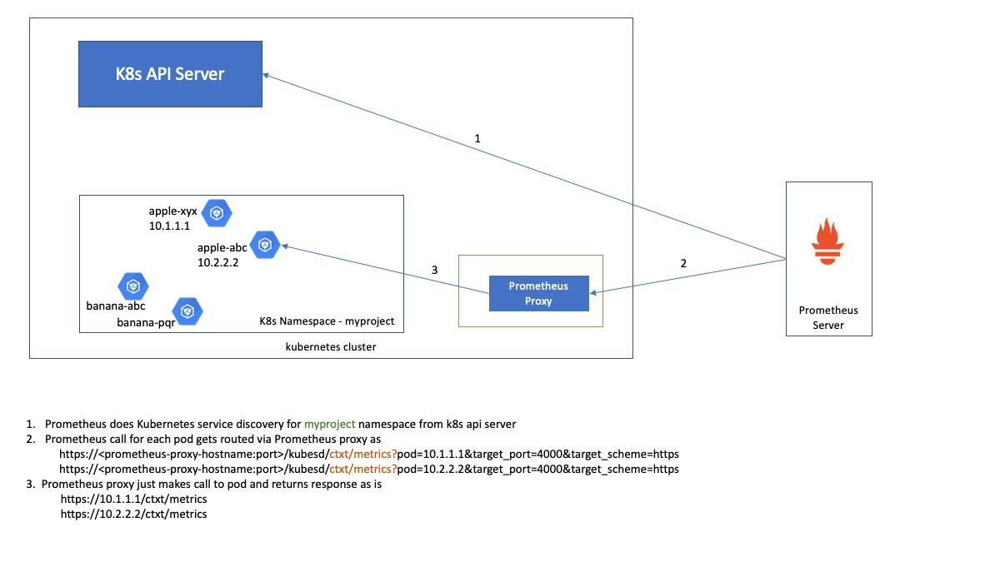

# Kubernetes Prometheus Proxy
Kubernetes Prometheus Proxy is an easy way to get prometheus metrics from application pods running in kubernetes cluster.

In kubernetes, applications are deployed in the form of pods and often there are multiple pods running for application in order to scale horizontally.
The application is accessible using ingress routers which directs the request to one of the application pod.

Prometheus is monitoring toolkit which follows pull approach to get the metrics from applications it is monitoring. 
It makes http call to the configured application target and stores the metrics that it receives in response.
Prometheus server has kubernetes service discovery abilities, which can talk to kubernetes api server and generate the list of target pod IPs it wants to scrape based on the configuration. 
However, for this to work, prometheus server should be able to reach the target pod ip. It can only do that if it is running inside kubernetes cluster.

What if your prometheus server is running externally and cannot reach the target pod ip?
Kubernetes Prometheus proxy is helpful proxy which allows pulling metrics from application pods running inside kubernetes cluster.
If kubernetes api servers are accessible from outside the kubernetes cluster, you can also configure kubernetes service discovery and pull metrics from pods with the help of this proxy using prometheus's powerful relabel configs.

<br>

## Use cases

#### Metrics from all pods

To pull metrics from all the pods use below http url

`http(s)://<prometheus-proxy-hostname>:<port>/mproxy/<kubernetes namespace>/<podname prefix>/<metrics uri>?upstreamPort=<metrics port>&ssl=<true|false>`

Where, <br>
**prometheus-proxy-hostname** :  hostname or domain name of prometheus proxy which is accessible externally <br>
**port** : port on which prometheus proxy is accessible externally <br>
**podname prefix**: the string with which your application pod names start with <br>
**metrics uri**: uri of the application which returns metrics <br>
**upstreamPort**: port on which application pods is exposing metrics on <br>
**ssl** : if application pod is listening on https then set to true else false. (default false) <br>
<br>


Implementation logic
1. Check if the metrics path is whitelisted path by matching it with regular expressions defined in METRICS_PATH_WHITELIST environment variable, if it does not match then return HTTP 500
2. Query kubernetes master to fetch all pods in the given kubernetes namespace
3. Filter pods which are in running state and whose name starts with podname prefix specified in url
4. Check if the pod IP address is within CIDR ranges defined in CIDR_WHITELIST environment variable. If it is not then ignore that pod IP
5. Query each pod individually using `http(s)://<pod ip>:<upstreamPort>/<metrics uri>` (It uses https if ssl=true)
6. Loop through each metric and add podip and podname as labels to metrics
7. Write all these updated metrics onto response
8. Close response when all pods have been scraped and their updated metrics are written on response

Example prometheus config
```
    - job_name: example-job
      params:
        upstreamPort:
        - "5043"
        ssl:
        - "true"
      metrics_path: /mproxy/project1/apple/ctxt/metrics
      scheme: https
      static_configs:
      - targets:
        - <prometheus-proxy-hostname:port>

```

<br>

#### Metrics using kubernetes service discovery

When kubernetes api server can be accessed from prometheus server running external to cluster, we can setup kubernetes service discovery and use proxy to pull metric from a pod.
Same whitelist checks are performed for checking IP address in whitelisted CIDR and metrics URI matches one of the regex defined in METRICS_PATH_WHITELIST before making http call to get the metrics.
For this job config will look like below

```  
    - job_name: <name of job>
       scheme: <http|https for kubernetes api server>
       params:
         target_scheme: [<http|https>]
         target_port: [<metrics port>]
       tls_config:
         insecure_skip_verify: true
       metrics_path: /kubesd/<metrics url>
       kubernetes_sd_configs:
       - api_server: <kubernetes api server>
         role: pod
         bearer_token_file: <location of the token file>
         namespaces:
           names:
             - <kubernetes namespaces>
         tls_config:
           insecure_skip_verify: true
       relabel_configs:
       - source_labels: [__meta_kubernetes_pod_ip]
         target_label: __param_pod
       - source_labels: [__meta_kubernetes_pod_name]
         target_label: podname
       - source_labels: [__meta_kubernetes_pod_ip]
         target_label: podip
       - target_label: __address__
         replacement: <prometheus proxy hostname>
       - source_labels: [__meta_kubernetes_pod_name]
         target_label: instance
``` 

In addition to above, you can use further relabel_configs to keep or drop pods to be used as targets.
For example,
```
    - source_labels: [__meta_kubernetes_pod_name]
      regex: .*myapp1.*
      action: keep
    - source_labels: [__meta_kubernetes_pod_container_name]
      regex: deployment
      action: drop
```

In above example, it will keep the pods whose pod name contains `myapp1` text, and it will drop pod whose container name contains `deployment` text.



<br>


## Environment Variables

| Environment Variable |                     Default Value                    |   Required    |                                                                            Description                                                                                   |
|:--------------------:|:----------------------------------------------------:|:-------------:|-------------------------------------------------------------------------------------------------------------------------------------------------------------------------:|
|   K8S_GLOBAL_TOKEN   |                                                      |    true       | Bearer token used to query kubernetes master to get pod                                                                                                                  |
|    CIDR_WHITELIST    |                                                      |    true       | comma separated CIDR list, the pod ip addresses should be within this defined ranges of CIDR                                                                             |     
|METRICS_PATH_WHITELIST|                                                      |    true       | comma separated metrics path regex whitelist. the metrics uri will be validated against these regex expressions and only matching URI will be queried for metrics        |
|      TOKEN_FILE      |  /var/run/secrets/kubernetes.io/serviceaccount/token |    false      | Absolute path of the file where bearer token is read from. If K8S_GLOBAL_TOKEN is defined then it takes precedence over TOKEN_FILE                                       |
|      K8S_CACERT      | /var/run/secrets/kubernetes.io/serviceaccount/ca.crt |    false      | Absolute path of CA certificate file. Used to talk to kubernetes master                                                                                                  |
|    K8S_NODEJS_PORT   |             5050 for http, 5053 for https            |    false      | Port on which app listens on                                                                                                                                             |
|       HTTP_PORT      |                         5050                         |    false      | If certificate environment variables are not defined then http server is started. It will listen on this port. If K8S_NODEJS_PORT is defined then that takes precedence  |
|      HTTPS_PORT      |                         5053                         |    false      | If certificate environment variables are defined then https server is started. It will listen on this port. If K8S_NODEJS_PORT is defined then that takes precedence     |
|   METRICS_HTTP_PORT  |                         5055                         |    false      | prometheus metrics for the proxy app are exposed on this port. It should be different than http/https port on which application listens on                               |
|     CERT_KEY_FILE    |                                                      |    false      | private key file                                                                                                                                                         |
|       CERT_FILE      |                                                      |    false      | public key file                                                                                                                                                          |
|     CERT_CA_FILE     |                                                      |    false      | CA certificate file                                                                                                                                                      |
| CERT_KEY_PASSWD_FILE |                                                      |    false      | password for private key is read from this file                                                                                                                          |
|    APP_URL_PREFIX    |                                                      |    false      | prefix context path. if set all URIs will be prefixed with this context. e.g. if value is set to v1 then URIs will be /v1/mproxy/ and /v1/kubesd/                        |

**Note:**
when metrics are exposed over https and certificates does not have pod ip as Subject name or Subject Alternative Name then the call to get metrics will fail giving invalid certificate error. In this case you can set environment variable NODE_TLS_REJECT_UNAUTHORIZED=0 which will disable certificate validation.  


## Contributing

We welcome Your interest in the American Express Open Source Community on Github. Any Contributor to
any Open Source Project managed by the American Express Open Source Community must accept and sign
an Agreement indicating agreement to the terms below. Except for the rights granted in this 
Agreement to American Express and to recipients of software distributed by American Express, You
reserve all right, title, and interest, if any, in and to Your Contributions. Please
[fill out the Agreement](https://cla-assistant.io/americanexpress/k8s-prometheus-proxy).

## License

Any contributions made under this project will be governed by the
[Apache License 2.0](./LICENSE.txt).


## Code of Conduct

This project adheres to the [American Express Community Guidelines](./CODE_OF_CONDUCT.md). By
participating, you are expected to honor these guidelines.
